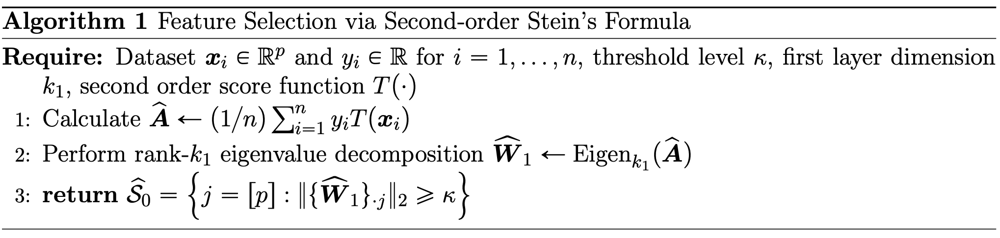
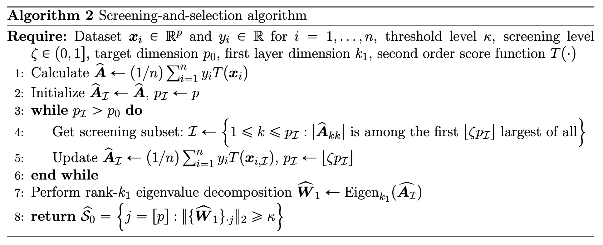

# A Nonparametric Statistics Approach to Feature Selection in Deep Neural Networks with Theoretical Guarantees

[](https://www.python.org/downloads/)
[](LICENSE)

This repository implements the feature selection methodology proposed in the paper **"A Nonparametric Statistics Approach to Feature Selection in Deep Neural Networks with Theoretical Guarantees"**.

## 📖 Paper Information

**Authors**: Junye Du†, Zhenghao Li†, Zhutong Gu, Long Feng*  
**Affiliation**: Department of Statistics and Actuarial Science, University of Hong Kong  
**Contact**: lfeng@hku.hk  
† Equal contribution


## 📦 Installation

### Requirements
- Python 3.8+
- NumPy
- PyTorch
- SciPy
- lassonet

### Install Dependencies

```bash
pip install -r requirements.txt
```


## 🎨 Algorithm Overview

### Algorithm 1: Feature Selection via Stein's Formula



### Algorithm 2: Feature Selection with Screening



## 🧪 Reproducing Experiments

### Run Low-Dimensional Experiments
```bash
cd Sec7_1_low_dimension_experiments
python sample_compare.py
python dimension_compare.py
```

### Run High-Dimensional Experiments
```bash
cd Sec7_2_high_dimension_experiments
python dimension_compare.py
python rho_compare.py
python sample_compare.py
```

### Run Prediction Experiments
```bash
cd Sec7_3_prediction_experiments
python sample_compare.py
python dimension_compare.py
```

### Run Time Comparison Experiments
```bash
cd Sec7_3_time_comparison
python time_comparison_sample_size.py
```

### Run t-Distribution Experiments
```bash
cd Sec7_4_high_dimension_t_experiments
python dimension_compare_t.py
```

## 📊 Experimental Results

Our method demonstrates superior performance in the following scenarios:

1. **Low-Dimensional Setting** (Section 7.1)
2. **High-Dimensional Setting** (Section 7.2)
3. **Prediction Performance** (Section 7.3)
4. **Non-Gaussian Distributions** (Section 7.4)

For visualization results, please refer to our paper.


## 📚 Citation

If you use this code in your research, please cite our paper:

```bibtex
@article{du2025nonparametric,
  title={A Nonparametric Statistics Approach to Feature Selection in Deep Neural Networks with Theoretical Guarantees},
  author={Du, Junye and Li, Zhenghao and Gu, Zhutong and Feng, Long},
  journal={},
  year={2025},
  publisher={Oxford University Press}
}
```

## 📧 Contact

For any questions regarding the code, please contact:
- Junye Du: junyedu@connect.hku.hk
- Department of Statistics and Actuarial Science, University of Hong Kong

## 📄 License

This project is licensed under the MIT License - see the [LICENSE](LICENSE) file for details.

---

**Keywords**: Feature Selection, Deep Neural Networks, Stein's Formula, Index Model, Nonparametric Statistics, High-Dimensional Statistics